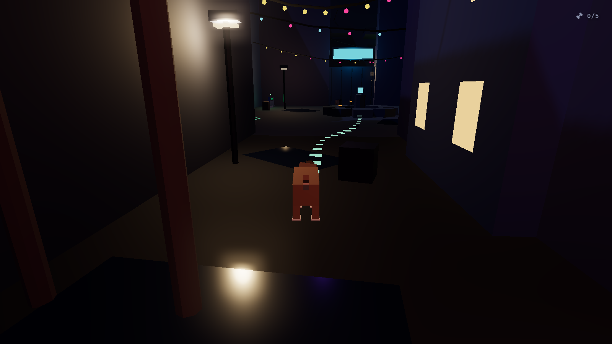

# GoodBoi 🐶

You are a stray dog in a neon robot city after the rain. The humans are gone, the
signs still buzz, and somewhere north of here there is a door that used to be yours.

**▶ [Play it in your browser](https://richardadonnell.github.io/goodboi/)** — no install, no account, about 20 minutes.



## What you do

Dog things, mostly. You bark at a robot until it notices you. You dig up a
streetlight repair bot's lost wrench and carry it back in your mouth. You carry a
fuse across a market alley to wake up an elevator, scatter some pigeons off a
rooftop ledge, and dig a collar tag out of the silt in a drainage canal — which is
when you remember where home is.

Six beats, two robots who want small favours, five bones hidden where you have to
actually look. Nothing chases you. Nothing can kill you. It's that kind of game.

## Controls

| Key | Action |
| --- | --- |
| `WASD` | Move |
| `Shift` | Run |
| `Space` | Jump |
| `B` | Bark |
| `Q` | Sniff — reveals a scent trail to your objective |
| `F` | Interact / pick up / drop |
| `X` | Dig (on loose earth) |
| `Esc` | Pause |
| Mouse | Look |

## Under the hood

Three.js and Vite, and nothing else. **Every asset in the game is generated at
runtime** — there are no models, no textures, and no audio files in this repo. The
dog, the robots, the pigeons, the whole district and its several hundred neon signs
are procedural geometry; the ambient pad, the bark and the footsteps are synthesized
in WebAudio the moment you click to play.

The static city merges down to ~40 draw calls via a geometry batcher, which is what
keeps a few hundred emissive signs, bloom, and a shadow-mapped moon inside a 60fps
budget. Collision is hand-rolled axis-separated AABB — no physics engine.

```
npm install
npm run dev      # dev server with HMR
npm run build    # static bundle in dist/
npm run preview  # serve the production build
```

Deploys to GitHub Pages on every push to `main`.

## Credits

Built with [Claude Code](https://claude.com/claude-code).
Owes its mood to *Stray*, and its priorities to dogs.
